## PD Talk

This is the official **PD Talk** for *The Frozen Divide: Nix*, hosted by Throne and Liberty Producer **Park Geon-su ("Sentry")**. In it, the team walks through everything coming with the Nix expansion: the new frozen dominion and its strongholds, the new **Gauntlets** weapon, Level 60 progression, a sweeping item-system overhaul, the **Remnants of Nix** PvP battlefield, powerful new bosses, and the full content roadmap through September. Below is a faithful, complete synthesis of what the producer said, organized by topic.

### Welcome & Overview
- The producer, **Park Geon-su (PD of TL)**, opens from "right in the middle of Nix," joking that he tried to acclimate early to the cold of this harsh new dominion.
- He's been preparing for this with genuine excitement: TL's new expansion, **The Frozen Divide: Nix**, teased gradually since last month, is finally arriving.
- The entire development team worked "day and night" to deliver greater depth and even more expansive content than **Talandre**.
- He promises to show the results one by one in detail, then "open the doors to Nix."

### The New Dominion: Nix
- **Nix** is the star of the update — the long-awaited dominion expansion. The team watched players travel to the edges of the borders looking for signs of new regions.
- Nix is completely different from **Laslan**, **Stonegard**, and **Talandre**: an extremely barren land where humans can barely survive, with relentless blizzards and an extreme environment.
- Because of these harsh conditions it became a **"Neutral Zone"** where neither the **Arkeum Legion** nor the **Resistance** could establish a presence.
- Nix is located in the **northeast of Talandre** and consists of **two strongholds** and **five hunting grounds**.
- The two strongholds — **The Aetherion** and the **Frontier Hold** — feature entirely new structures never before seen in TL, promising a truly fresh experience.
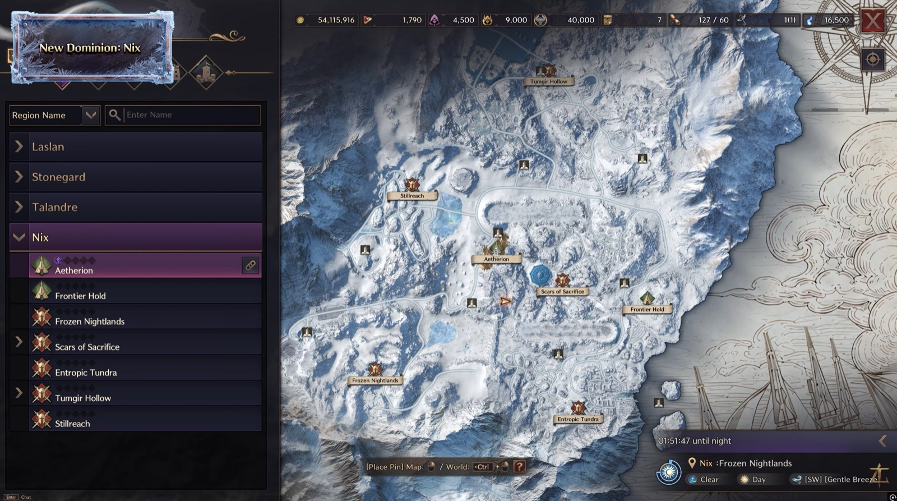

### The Two Strongholds: The Aetherion & Frontier Hold
- **The Aetherion** is the first place you'll encounter — an iconic **Aerial Stronghold** floating in the skies of Nix.
- **DaVinci** secretly mobilized the Resistance, **Venelux** magic, and even **Dimensional Circle** technology to create this massive vessel. Why he brought The Aetherion to Nix, and what events await, unfold in the newly added **Adventure Codex**.
- Simply gazing down at Nix's snowy landscape from atop this massive airship is described as a truly special experience.
- The **Frontier Hold** is an **underground fortress-type stronghold** with a completely different charm — a special place where **no one can fight**, regardless of origin, race, or ideology.
- Because of this, its Adventure Codex presents yet another crisis that only Adventurers can resolve. You descend deep underground through a separate entrance.
- At the Frontier Hold you can purchase **"Frozen Scrolls,"** items usable only in Nix, with various effects spanning offense, defense, support, and even playful ones — the producer highly recommends trying them.

### Nix's Five Hunting Grounds & Lore
- Nix consists of five regions: **Frozen Nightlands**, **Scar of Sacrifice**, **Entropic Tundra**, **Tumgir Hollow**, and **Stillreach**.
- Lore: long ago, the war between **giants and elves** tore open a rift to **Diabolica**. The elven mage **Shemir** sacrificed himself to seal it, and the land has been trapped in ice and snow ever since — traces of which remain throughout Nix.
- Each region has distinct terrain, environments, and monsters, with the rich environmental detail and lively NPC interactions TL is known for.

### Solo Dungeons & Field Events
- Unlike other dominions, Nix has **no separate party-type Abyssal Dungeons**. Instead it has **"Solo Dungeons"** entered by consuming specific items — "personalized content" focused solely on your own growth, at any time you choose.
- The new Solo Dungeon is located at the entrance to Nix's **Tumgir Hollow**, challengeable anytime.
- **"Field Events"** move away from the old fixed-schedule system; Adventurers now decide the flow of their own gameplay and no longer need to wait for specific times — start and participate whenever you want, with like-minded companions.
- For this update the team prepared **25 types of Field Events**, each with its own story and progression.
- Completing Field Events lets you obtain **"Redfrost"** items, Nix's core rewards.
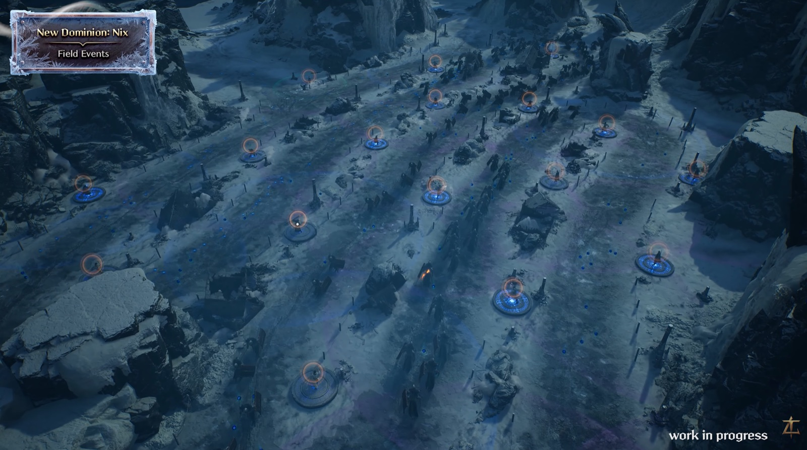

### New Transportation: Aethersuit & Auroral Path
- Recalling **Gigantrite**, **Minutrite**, and **Breezeline** that connected Laslan, Stonegard, and Talandre, Nix is equally vast and gets its own unique transportation.
- The **"Aethersuit"** is a high-speed descent device for quickly dropping from The Aetherion to the ground. It reaches targets much faster and more dynamically than **Glide Morphs**, dramatically reducing travel time for joining battles or exploring.
- Nix has **no Waypoints** except at certain strongholds. Instead you travel via the **"Auroral Path,"** a path of artificial starlight in the sky connecting regions.
- You access the Auroral Path using **"Star Beacons"** scattered throughout the field — riding it across Nix's skies to enjoy the snowy scenery and quickly join the battlefield.
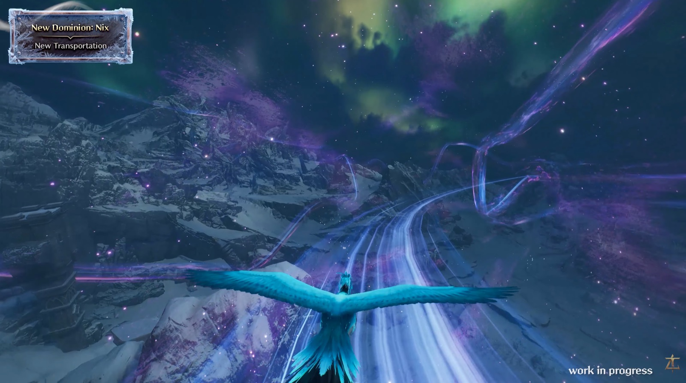

### Story: Adventure Codex Part 3 "Driftmoor"
- Alongside the Nix update comes **Adventure Codex Part 3, "Driftmoor,"** composed of **six acts**.
- It follows what happened to **Clay** and **Iska**, who left for Nix at **Janice's** call from Talandre.
- In this harsh land neither Arkeum nor the Resistance could conquer, the team looks forward to your journey as **Star Bearers** and members of the **Resistance**.

### Level 60 Progression & Growth Systems
- With this update the **maximum character level expands to 60**, and maximum skill levels increase accordingly.
- **Skill Specialization Points** expand to a maximum of **110**, and **Mastery Points** up to **220**, providing broader combat settings and more personalized growth.
- Level growth goes beyond simple number increases — it's a process of overcoming Nix's harsh environment and proving your strength at a higher stage.
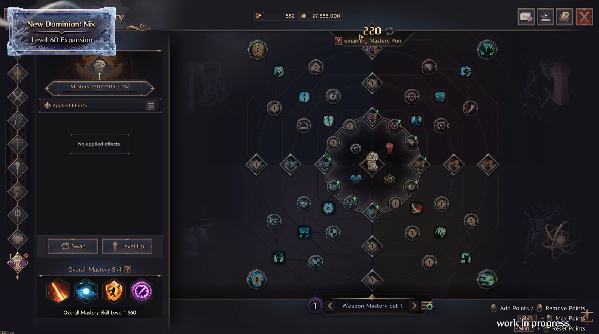

### Item System Overhaul: Grade Consolidation & Item Level
- Described as the change with the **biggest impact on gameplay**. Until now TL used sub-tiers within the same grade (e.g., Heroic Tier 1, Tier 2). As new grades were added, growth costs kept rising and lower-tier items lost value too quickly — a huge barrier, especially for new Adventurers.
- The biggest change: **"Item Grade Consolidation"** plus an **"Item Level System."** Complex tier distinctions are eliminated, grades consolidated into simpler categories, and each item is assigned an **Item Level** representing its true power — higher number, more powerful, at a glance.
- TL's growth structure shifts entirely from **"enchantment" to "acquisition."** Equipment can be used immediately in combat the moment you acquire it, with no complex processes.
- How you obtain higher-level gear: as your character grows and you play consistently, the level of equipment you acquire naturally rises. The higher your max acquired equipment level, the higher the level of new items you get.
- High-difficulty, powerful gear like **Archboss weapons** appears at a **"high fixed level"** befitting its value — challenge it with confidence. Consistently hunting and challenging content at your level becomes your natural growth progression, focused on "the fun of hunting and acquiring" rather than complex spec calculations.
- The old **"Lithograph"** system for making items tradeable is unified into a **"Seal"** function. Sealed items have levels determined by your character's growth level. You simply decide: seal a farmed item and list it on the **Auction House**, or equip it yourself.
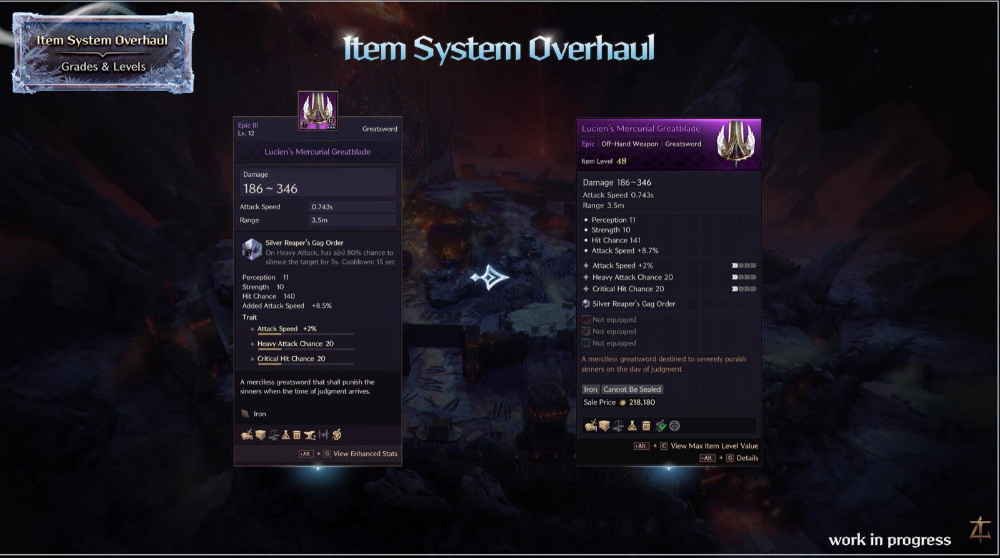

### Equipment Trait System Redesign
- The **"Equipment Trait"** system that determines core gear performance is being redesigned around **"choice" and "intuitiveness."**
- Previously you had to use equipment of the same category carrying the desired trait as material; it was hard to identify valid materials, completing combinations was complex, and the UX was inconvenient.
- Now, as long as you have the materials, you can **directly select and unlock the traits you want**. The old method of consuming equipment is gone, and material sources/requirements are reasonably adjusted.
- A new **"Trait Enhancement Item"** is added so you can clearly enhance only the traits you want. Simplified materials make it easier to assess your current trait status and resolve inventory-space issues. These items are still obtained through in-game content as before.
- Traits now have a **level concept**, so you'll need Trait Enhancement Items matching your equipment level — a safeguard to prevent gaps between Adventurers from widening as item levels expand in the future.
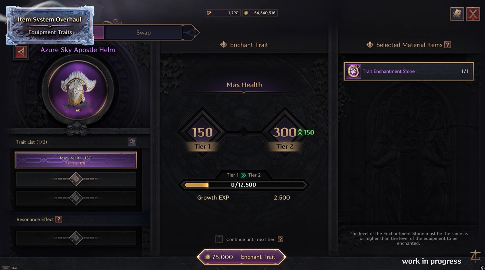

### Abolishing Enchantment, Transfer & Sync — Inheritance System
- With the Item Level System and Trait Overhaul making growth more intuitive, the team boldly lets go of the burdensome enchantment system. Starting with this update, the **Enchantment, Transfer, and Sync systems are completely abolished.**
- Your built-up growth will **not disappear**: existing enchantment stages are automatically reflected in the new Item Level, so you can continue powerful gameplay immediately after the update.
- Recently added or high-value equipment will be **calibrated to Nix-level standards**, and the team is preparing **compensation** so there's no loss to your **Sync** investment.
- **Transfer** is replaced by the **"Inheritance"** system. Where old Transfer simply relieved enchantment-stage burden, Inheritance now naturally carries over the **trait settings** you've completed on your equipment.
- Previously Transfer was only possible between the same slot with various restrictions. Now **level transfer is possible without slot restrictions within the same equipment category**, reducing stress and letting you freely experiment with builds.
- This is the core of the overhaul: not just swapping equipment, but enabling diverse choices based on combat style and situation while respecting your investment — so you can focus purely on the joy of farming for higher-level items.
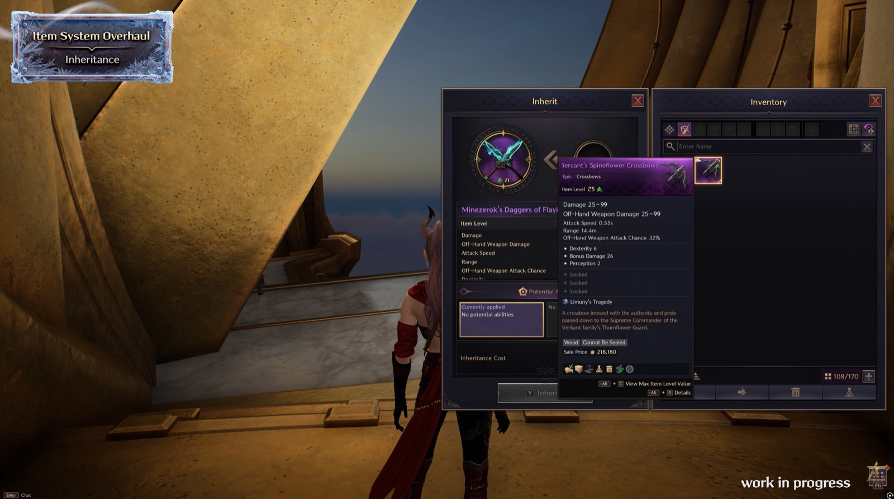

### Remnants of Nix: The Endgame PvP Battlefield
- Introduced as the **highlight** of the update — "the true battlefield for the strongest." **Remnants of Nix** is an **inter-server PvP space** like the existing **Nebula**, but with completely new progression and farming rules.
- It runs on a **"session system"** where channels are dynamically created based on player count. You can enter freely at any time, but once a session is created it stops accepting new players after a certain time — designed to keep you on edge.
- The environment is far harsher than the regular Nix field: **constant heavy snowfall reduces HP recovery** as a penalty, and the terrain is more three-dimensional to maximize combat.
- The biggest difference from existing content: it supports **small elite party play of 1 to 4 players, not guilds.**
- Elite monsters and chests spawn across the map but **do not respawn** once killed or looted, creating fierce competition to secure limited resources first.
- Strategic choice: aim for powerful **bosses** during the session, or take down less-contested elite monsters and safely withdraw.
- The **"Escape"** system: **after 5 minutes** from session start you can escape with your acquired treasures. Die or leave without purifying and you **lose everything** — keeping you on edge until the moment of escape. Once you've farmed enough you can enter a new session and continue.
- Use the earlier **Frozen Scrolls** for diverse strategies — shaking off pursuers, surviving with utility items, etc.
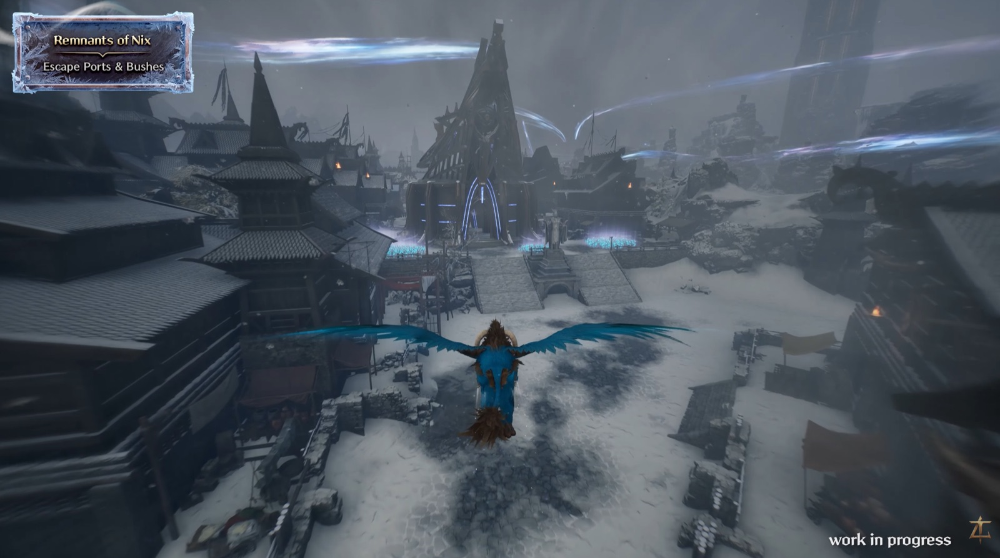

### Remnants of Nix: Escape Ports, Bushes & Auroral Path
- **Escape Ports:** each hunting ground in Remnants of Nix has **2 Escape Ports**, totaling **10 across the map**. Protecting what you've gained matters as much as acquiring it — find an Escape Port immediately to preserve precious loot.
- The number of available Escape Ports **decreases over time**, forcing urgent decisions: retreat before opportunities vanish, or risk it for greater rewards.
- **Bushes** throughout the field are key to stealth and ambush: hide in a bush and external players can't see inside or even target you until they enter the same bush — use it to overcome unfavorable situations or set deadly ambushes.
- The **Auroral Path** activates after a certain time post-entry; riding the artificial starlight lets you move quickly across the battlefield and shake up the tide of battle.
- Together — psychological warfare around Escape Ports, bush-based ambushes, and maneuver warfare via the Auroral Path — make Remnants of Nix an unpredictable, thrilling battlefield shaped by your every decision.
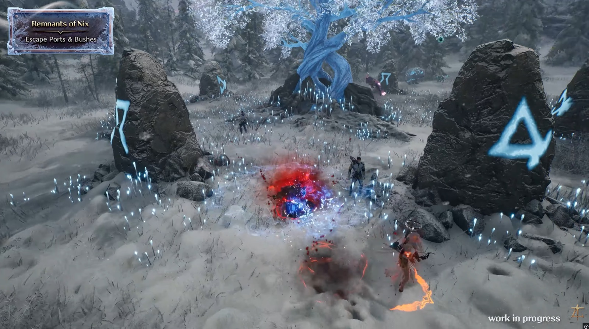

### Redfrost Items, Purification & the Remnants Pouch
- The reason to fight this battlefield is to obtain **"Redfrost Items,"** Nix's core rewards. They can be acquired in both the general field and Remnants of Nix, but **Remnants of Nix is ultimately the core farming ground** for top-tier items with overwhelming performance.
- Acquired items start in an **"Unappraised"** state and can't be used right away. Die while carrying them, or leave the battlefield without authorization, and you can lose your loot.
- To make them yours you must find a **"Sanctum of Purification"** scattered across the field and complete the purification process. Only after purification can items move to your regular inventory and be equipped.
- A **"Great Success"** during purification lets you register the item on the **Auction House** for significant profit.
- There's **no limit on how many items you can carry out** of Remnants of Nix, but you can only **purify items within your available Purification Points.**
- Unpurified items registered in your **"Remnants Pouch"** are **protected even upon death**. Pouch space is extremely limited, so store your most precious gear there. Strategically using the limited Remnants Pouch to safely reach an Escape Port is the "transport tension" that's the greatest reason to enjoy Remnants of Nix.
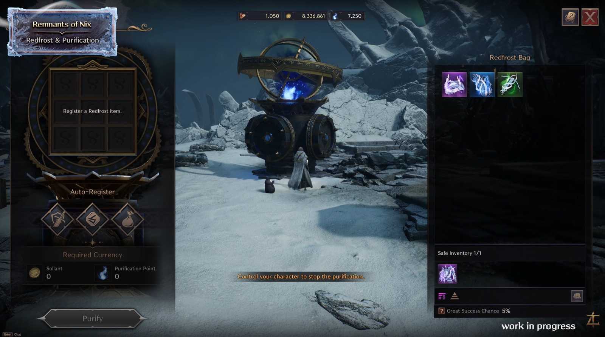

### New Weapon: Gauntlets
- TL's **third new weapon: Gauntlets** — maximizing the "feel" of close-range combat through weighty impact and powerful skill chains.
- They suppress opponents with **collision and stun effects**, and can serve as a **tank** by drawing enemy attacks with high threat. The true charm is adapting combat style to the situation — dropping defenses to maximize firepower, dramatically increasing attack power for fast, sharp chain combos completely different from base mode.
- Core skills are **"Sweep"** and **"Decisive Blow."** Sweep is the key initiation skill, quickly closing in to start combat, locking enemies down and creating favorable momentum. Decisive Blow follows up with a heavy blow that pressures enemies, completing the signature powerful impact.
- In **base Gauntlets mode** you lead combat through stable engagement and chains. Entering **"Eclipse of Blood"** flips your style 180 degrees: using **"Ravenous Flurry"** and **"Blood Talon,"** you unleash aggressive combat. Ravenous Flurry grows stronger with each successive attack; based on that momentum you choose **"Lifesteal"** for HP recovery or **"Crimson Burst"** for devastating damage — a thrill of dense, concentrated attacks in a short window.
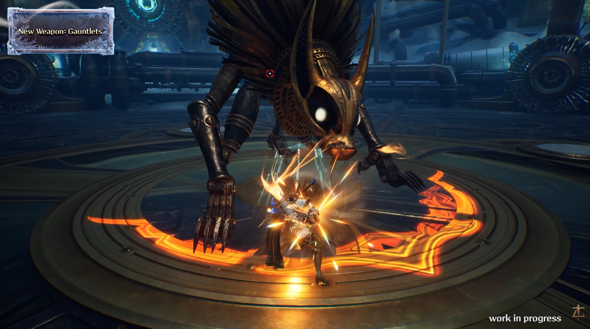

### Gauntlets: Combinations, Block Chance & Design Philosophy
- Anticipated combination weapons: **Greatsword** and **Daggers**. With Greatsword, defensive performance and stability are enhanced to firmly hold the frontline and fulfill the tank role. With Daggers, play focuses on aggression, boosting Gauntlets firepower for higher damage.
- Gauntlets are the **third weapon to use the off-hand activation mechanic**, after **Daggers** and **Crossbows**. In Eclipse of Blood, **Block Chance converts to Off-hand Weapon Attack Chance** — defensive effects transition into offensive utility.
- There's synergy beyond Greatsword and Daggers: e.g., the **Bleed Damage from Eclipse of Blood** also applies to **Wand's Curse Explosion** damage. Depending on combination, entirely new combat styles are born. With Gauntlets added, **45 total weapon combinations** are now possible.
- Though not a shield weapon, Gauntlets use existing shield-based stats. **"Shield Block Chance"** and **"Shield Block Penetration Chance"** are renamed to **"Block Chance"** and **"Block Penetration Chance."** Block Chance now expands as a key mechanic for **both Greatsword and Gauntlets.**
- Design philosophy: a weapon standing "on the border between tank and DPS." In PvP you draw attention and dig into enemy lines to hold the frontline, then switch to Eclipse of Blood for a tide-turning reversal; in PvE boss fights it flexibly switches between offense and defense. High Block Chance holds the frontline in normal mode, then converts to Off-hand Weapon Attack Chance in Eclipse of Blood — one stat freely alternating defense and offense. The team hopes Gauntlets become the ultimate choice for those craving a new combat experience.
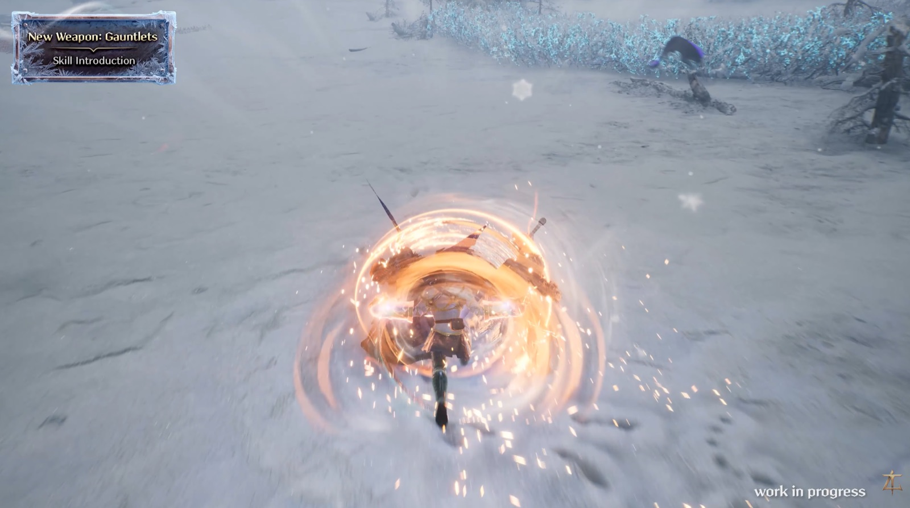

### Combat Systems: Skill Cores & Chain Skills
- **Armor and Accessory Skill Cores** are added — you can now engrave Skill Cores not only on weapons but also on **Heroic Armor and Accessories.**
- Unlike weapon cores (extracted from existing skills), these are obtained through **Nix exploration and various content.** The number you can equip is limited, so effects are extremely powerful — beyond stat boosts, they can completely transform existing weapon skills.
- Example: equipping the Greatsword's **"Valiant Brawl" Unique Skill Core** transforms that close-range skill into a **Slash Wave** attack that hits enemies from a distance.
- These cores come from Nix field content as well as **Dimensional Trials, Battlegrounds, and Co-Op Dungeon** rewards. Dozens of lineups exist, from stat boosts to **proc-based passives**.
- A new **"Chain Skill"** feature helps utilize builds in practice — setting up and executing complex DPS cycles efficiently for smoother combat. Each class has **recommended chain presets** pre-configured: use a specific skill and the next chainable skill immediately activates; press the chain key and registered skills flow naturally for more intuitive, faster combat.
- Especially designed for split-second responses to use multiple skills without waste. Chain configurations are **customizable** to proficiency and preference — helping new Adventurers adapt while letting experienced ones build optimized cycles for added depth.
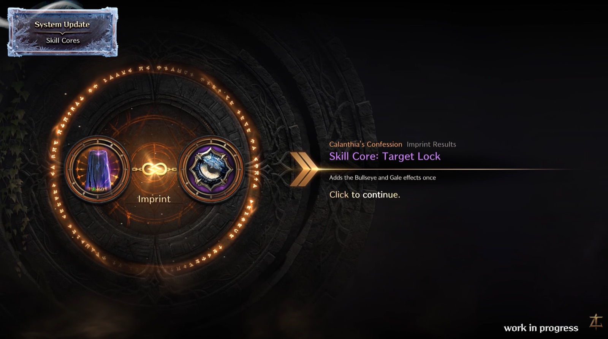

### Field Elite Overhaul (PvE & PvP Modes)
- A complete overhaul of field elite value and gameplay — restructured elite compositions across the field with significantly enhanced rewards for the "thrill of loot drops."
- Field Elites operate in **two modes: PvE and PvP.** Existing elites from **Stonegard, Laslan, and Talandre** return with improved combat — **over 40 types** total — and Nix adds **5 new elite types.**
- **PvP Mode Elite:** only one appears, very rarely, in each dominion. The area around it instantly converts to a **PvP zone**; combat and boss fights interweave in real time. It appears at **maximum level 60** regardless of zone level, offering challenging difficulty worthy of powerful rewards.
- **PvE Elites:** appear one per region at regular intervals, scaled to the region's level, so they're easier to challenge. **No attempt limits** — fight through competition and win, and the rewards are entirely yours, in a true open field without time constraints.
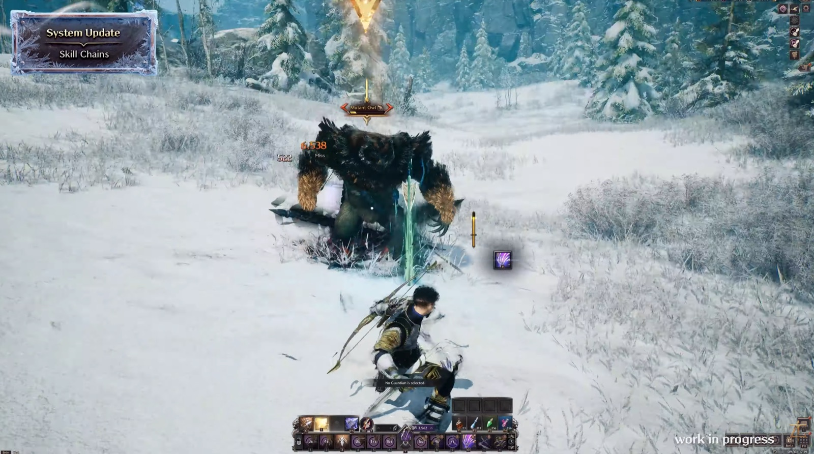

### More Systems & New Stages (Runes, Life Skills, Co-Op Dungeons, Bosses)
- Briefly previewed: the **"Rune System"** for armor and **"Life Skills"** enriching the **Solisium** experience will be partially revealed. **New passive skills per weapon** are added for deeper skill-tree research.
- **2 new Co-Op Dungeons** designed from scratch deliver entirely fresh strategy experiences.
- **2 new Field Bosses, Thuban and Porfos**, heat up Nix's fields — the massive gorilla boss glimpsed in the Nix trailer, and the boss that froze everything around it.
- Existing **Talandre Field Bosses** are upgraded and added as **Ascended Field Bosses.**
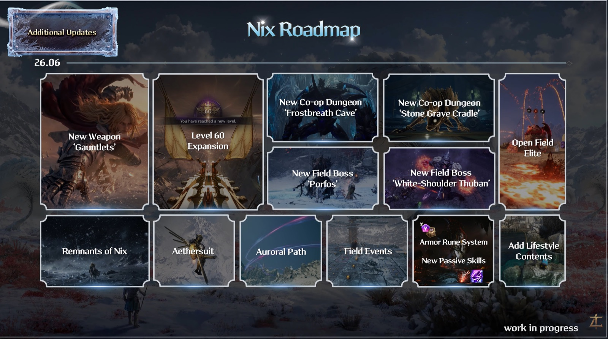

### Content Roadmap: New Archbosses (July–September)
- **July:** the new Archboss, Dragon Knight **"Ramux,"** arrives — soaring freely through the skies with a very special hidden mechanic.
- **August:** the Colossus **"Vegamor,"** of overwhelming scale, is in preparation — an unprecedented scale in TL history.
- On equipment hierarchy: as a new generation opens, hierarchy naturally adjusts, but existing equipment doesn't lose value. **Queen Bellandir** and **Tevent** weapons pass the top spot to the next generation, but their unique **Weapon Skill Cores** remain irreplaceably powerful and situationally formidable even after Nix.
- **Talandre Archboss weapons** from **Deluzhnoa** and **Giant Cordy** maintain top-tier status in the Nix environment alongside new Archboss gear. The team is calibrating to present new goals while respecting prior investment — aiming for diverse viable equipment choices based on style and strategy rather than a blanket replacement.
- **September:** a new challenge tests your limits again, and existing Co-Op Dungeons are overhauled into a **"Single Mode"** to clear solo — **5 dungeons converted first**, with the rest to follow — bringing new enjoyment for those wanting to prove individual growth.
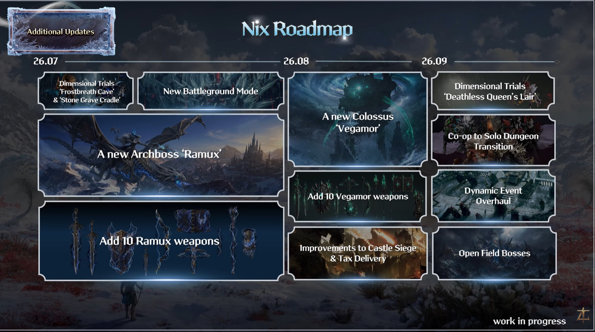

### Character Boost, Closing & Celebration Gift
- A new **"Character Boost"** system helps you jump in quickly — different from the existing **Hyper Boosting**. On use you **instantly reach Level 55** with basic equipment fully set up, an efficient choice for entering Nix's upper-tier content fast. The journey **from Level 1** through Solisium's narrative remains carefully kept open for those who prefer it.
- Closing thanks: the entire team deliberated intensely and prepared with all their hearts, hoping the new dominion and systems bring fresh energy and lasting memories, and pledging to keep improving Solisium using player feedback.
- A celebration gift: an **"Update Celebration Coupon"** — check the coupon code on screen to start your Nix adventure richer.
- The update arrives **June 25th**; the producer signs off, looking forward to meeting again "in Nix's cold blizzard."
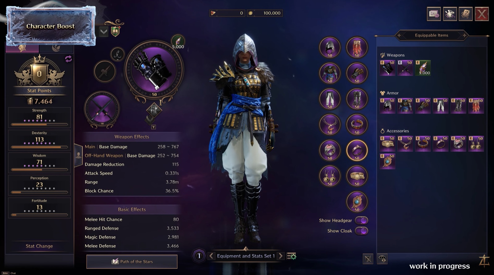
